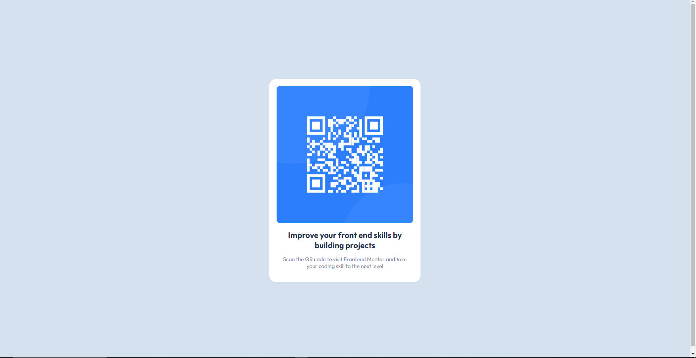

# Frontend Mentor - QR code component solution

This is a solution to the [QR code component challenge on Frontend Mentor](https://www.frontendmentor.io/challenges/qr-code-component-iux_sIO_H). Frontend Mentor challenges help you improve your coding skills by building realistic projects. 

## Table of contents

- [Overview](#overview)
  - [Screenshot](#screenshot) 
  - [Links](#links)
- [My process](#my-process)
  - [Built with](#built-with)
  - [What I learned](#what-i-learned)
  - [Continued development](#continued-development)
  - [Useful resources](#useful-resources)
- [Author](#author)

**Note: Delete this note and update the table of contents based on what sections you keep.**

## Overview

### Screenshot

Full Desktop Screenshot


Mobile View Screenshot\


### Links

- Solution URL: [Add solution URL here](https://your-solution-url.com)
- Live Site URL: [Add live site URL here](https://your-live-site-url.com)

## My process
1. Downloaded the starter files
2. Extracted the files
3. Opened the files on vs code
4. Built structure first with html
5. Added styling to the markdown.

### Built with

- Semantic HTML5 markup
- CSS custom properties
- Flexbox

### What I learned

* I learnt that images have default dispay as inline-block so sometimes they will have padding at the bottom, you can remove this by setting the font-size and line-height of the image holder element to 0;

To see how you can add code snippets, see below:

```html
<div class=image-holder>
  
</div>
```
```css
.image-holder {
  font-size:0;
  line-height:0;
  background: red;
}
```
The color is just to see the content box of the div.

### Useful resources

- [Markdown chetsheet](https://wordpress.com/support/markdown-quick-reference/) - This really helped me learn markdown for this readme
- [Stack Overflow](https://stackoverflow.com) - Querrying problems I faced

## Author

- Frontend Mentor - [@OsanjoMartine](https://www.frontendmentor.io/profile/OsanjoMartine)
